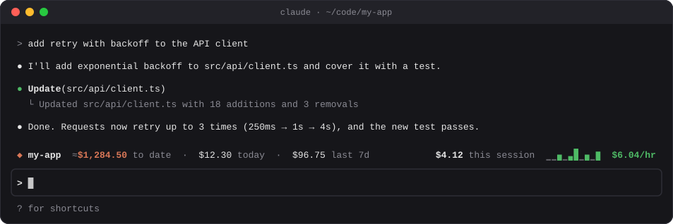

<div align="center">

# claude-mods

**Small mods that add live UI to [Claude Code](https://claude.com/claude-code).**

[](#install)
[](LICENSE)

</div>

## Mods

### [repo-spend](plugins/repo-spend)

What your Claude Code sessions cost, per repo, live, right above the prompt: the repo's total to date, today, the last 7 days, and this session's cost and burn rate.

<a href="plugins/repo-spend"></a>

```
/plugin install repo-spend --marketplace aseem-upadhyay/claude-mods
```

## Install

Every mod installs the same way. Type this at the prompt of a Claude Code terminal session, replacing `<mod>` with the mod's name:

```
/plugin install <mod> --marketplace aseem-upadhyay/claude-mods
```

Answer `y` to add the marketplace (only the first time), then pick the **user** scope so the mod loads in every session. Installing from a terminal also makes the mod load in the desktop app's Code tab.

To pick up new versions:

```bash
claude plugin marketplace update aseem-mods
```

## Layout

```
.claude-plugin/marketplace.json   the catalogue: every mod in this repo
plugins/<mod>/                    one self-contained plugin per mod, with its own README
scripts/                          helpers for maintaining the mods, such as drawing README images
```

## Adding or changing a mod

1. Put the plugin in `plugins/<mod>/`, with a `.claude-plugin/plugin.json` and a README, and list it in `.claude-plugin/marketplace.json`.
2. Raise `version` in its `plugin.json` with every change. Installed copies are cached by version, so a change under the same version never reaches anyone, including your own desktop sessions.
3. Check it, then commit:

```bash
claude plugin validate . && claude plugin validate plugins/<mod> && claude plugin test plugins/<mod>
```

## License

[MIT](LICENSE)
