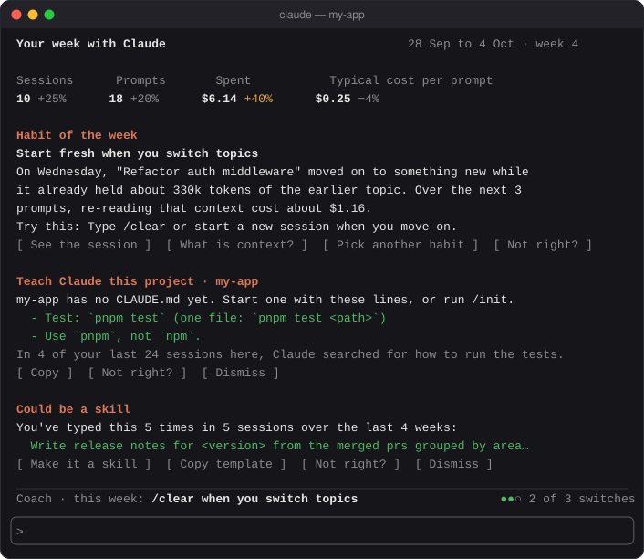
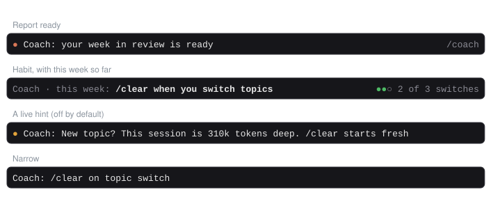
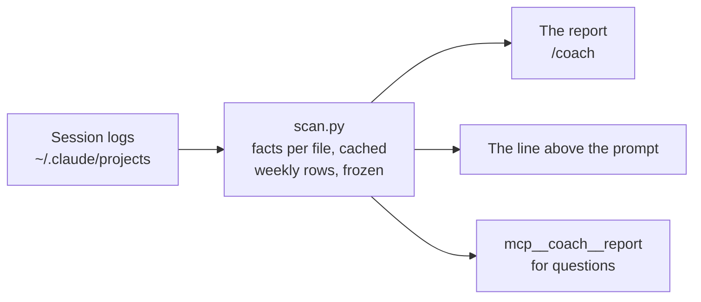

<div align="center">

# coach

**How well are you using Claude Code, and what's the one thing to get better at next?**

A weekly coach built from your own sessions: one habit at a time, tips at your level, CLAUDE.md lines and skills worth making, and your progress over the weeks.

[](#install)
[](#requirements)
[](#requirements)
[](../../LICENSE)


<p><sub>The report, and the line above the prompt</sub></p>

</div>

## Features

- 🎯 **One habit at a time.** Each week coach picks the habit that would help you most, shows you the session it came from and what it cost, and tells you what to try. It sticks with a habit for two weeks, and retires it once you've got it.
- 📚 **CLAUDE.md lines from what Claude keeps rediscovering.** How to run the tests, the package manager it gets wrong, the files it reads first, the corrections you keep making: ready to copy, with the evidence. Suggestions only: coach never writes your CLAUDE.md.
- 🧩 **Skills from prompts you keep typing.** A prompt typed in nearly the same words again and again becomes a suggested skill, with a template and the follow-up you usually add. "Make it a skill" puts a request in the prompt box for you to send.
- 📈 **Progress over the weeks.** Cost per prompt, corrections, oversized sessions, rediscovery, and your habit, week by week. Finished weeks are kept, so the history survives Claude Code deleting old logs.
- 🪜 **Tips at your level.** Beginners see the basics; experienced users see advanced tips. Every tip is backed by your own sessions and retires once you've taken it up.
- 🔒 **Local first.** It reads the logs Claude Code already keeps and sends nothing anywhere. Grading prompts with a model is opt-in.

## Install

Type this at the prompt of a Claude Code terminal session:

```
/plugin install coach --marketplace aseem-upadhyay/qol-mods
```

Answer `y` to add the marketplace (only the first time), then pick the **user** scope so coach loads in every session. Installing from a terminal also makes it load in the desktop app's Code tab.

The first report is ready a few seconds after your next session starts: coach reads the logs you already have, so there's no week to wait.

## Using it

| Command | What it does |
| --- | --- |
| `/coach` | Opens the report on your last full week |
| `/coach tips` | Every tip worth showing now |
| `/coach claude-md` | Every CLAUDE.md suggestion, per project |
| `/coach skills` | Every prompt worth making a skill |
| `/coach bar` | Hides or shows the line above the prompt |
| `/coach hints` | Turns live hints on or off |
| `/coach rescan` | Reads every log again |

You can also ask Claude about your week in plain words ("why did my cost jump on Tuesday?"): coach gives it a tool that reads the report.



The line above the prompt says when a new report is ready, then keeps your habit in view for the rest of the week. It stacks with other mods' bars, such as repo-spend's.

## Reading the report

| Section | What it shows |
| --- | --- |
| **Headline** | Sessions, prompts, spend and the typical cost of a prompt, against your average for the four weeks before |
| **Habit of the week** | The habit, the session it came from, what to try, and how this week is going. "See the session" opens the evidence; "Not right?" hides it and teaches coach |
| **Your best prompt** | Your strongest opening prompt of the week, and why it worked. With grading on, one prompt rewritten from what your follow-ups said instead |
| **Teach Claude this project** | CLAUDE.md lines for what Claude rediscovers, with "Copy" |
| **Could be a skill** | A prompt you keep typing, its template, and "Make it a skill" |
| **Progress** | Up to 12 weeks of the numbers that matter, a gap where definitions changed |
| **Features you've used** | What you've tried at your level and the next, and the one feature to try next |
| **Level up** | One or two tips, each with its evidence |
| **Also noticed** | Safety first: sessions with permission checks off, a costly day, API errors |

The five habits are: start fresh when you switch topics; point Claude at the right place; say what done looks like; ask Claude to check its work; plan big changes first.

## How it works



`hooks/scan.py` reads each log once, keeping what it found per file (cached by size and modification time), and works out each week: costs at API list prices, what you typed and what Claude did, and where the habits stand. A week is frozen in `~/.claude/coach/history.json` six hours after it ends. The hooks module draws the report and the line, and runs the scan again every 10 minutes.

## Settings

Open `/config` and find coach, or set them under `pluginConfigs.coach.options` in `~/.claude/settings.json`.

| Setting | Default | What it does |
| --- | --- | --- |
| `excludeProjects` | none | Folder paths coach never reads, comma-separated |
| `storeExcerpts` | on | Keep short, scrubbed cuts of prompts as evidence. Off also turns off the CLAUDE.md lines and skill templates made from your own words |
| `contextThresholdK` | 300 | Thousands of tokens of context at which a session counts as oversized |
| `weekStartsOn` | monday | `monday` or `sunday` |
| `promptGrading` | off | Once a week, send up to 20 opening prompts to Anthropic to be scored and one rewritten |
| `gradingModel` | haiku | `haiku` or `sonnet` |
| `gradingCapUsd` | 0.25 | Skip a week's grading when its estimate is over this |
| `liveHints` | off | Short hints at the moment they apply: at most one every 30 minutes and three a day |

## Requirements

- Claude Code with mod (hooks module) support
- `python3` 3.9 or newer on your `PATH`. Without it, `/coach` says how to install it
- macOS or Linux. Windows isn't supported yet

## Accuracy

- Costs are estimates at API list prices, scaled to Claude Code's own `/cost` total wherever a session has one. On Pro or Max, they're what your usage would have cost on the API.
- The habits and suggestions come from patterns in your logs, in English. Every finding shows the session it came from so you can judge it, and "Not right?" turns off a detector that keeps getting it wrong for you.
- coach can only see logs Claude Code still keeps: 30 days by default (`cleanupPeriodDays`). Weeks it has frozen stay, even after their logs are gone.

## Privacy

- With grading off, nothing leaves your machine. There are no network calls.
- It reads your session logs, and the CLAUDE.md files and skills on disk to leave out what you already have. It never writes any of them.
- It keeps its data in `~/.claude/coach/` (or `$CLAUDE_CONFIG_DIR/coach/`), readable only by you. Prompt excerpts there are at most 200 characters, scrubbed of anything that looks like a secret, and dropped after 12 weeks; turn `storeExcerpts` off to keep none.
- With grading on, a sample of opening prompts goes to Anthropic through Claude Code's own client, once a week. Nothing else is sent.
- To remove everything, delete `~/.claude/coach/`.

<details>
<summary><b>Development</b></summary>

From the repository root:

```bash
claude plugin validate plugins/coach
```

```bash
claude plugin test plugins/coach
```

```bash
python3 -m unittest discover -s plugins/coach/tests
```

Run it from a working copy without installing:

```bash
claude --plugin-dir plugins/coach
```

The TypeScript tests read fixtures made by the Python side, so the two agree. After changing what `scan.py` reports, write them again:

```bash
python3 plugins/coach/tests/make_fixtures.py
```

`hooks/pricing.py` is a copy of `shared/pricing.py`; edit that one and run `python3 scripts/sync-shared.py`. The images in `assets/` are drawn by `scripts/coach-assets.py`. [SPEC.md](SPEC.md) has the full design.

Every change ships as a new `version` in `.claude-plugin/plugin.json`: installed copies are cached by version.

</details>
