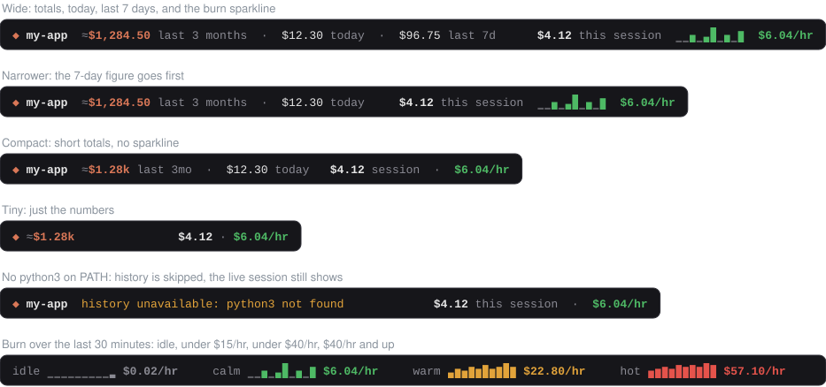
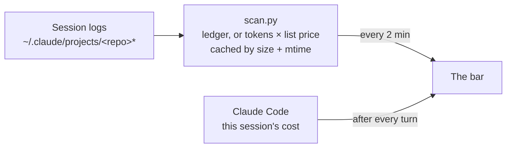

<div align="center">

# repo-spend

**What your Claude Code sessions cost, per repo, live, right above the prompt.**

[](#install)
[](#requirements)
[](#requirements)
[](../../LICENSE)


</div>

## Features

- 💰 **Lifetime cost per repo.** Every session ever run in the repo, its Claude worktrees included, plus today and the last 7 days.
- 📈 **Live burn rate.** This session's cost and its pace over the last 30 minutes, with a sparkline that turns amber and then red as the pace climbs.
- 📐 **Fits any width.** At narrower widths it drops the least important details rather than cutting the line off.
- 🔒 **Local only.** It reads the session logs Claude Code already keeps on your machine and sends nothing anywhere.
- ⚡ **Cheap.** Only changed logs are re-read, so a rescan of a busy repo takes about 0.1 s.

## Install

Type this at the prompt of a Claude Code terminal session:

```
/plugin install repo-spend --marketplace aseem-upadhyay/claude-mods
```

Answer `y` to add the marketplace and pick the **user** scope. The bar shows up in every session from then on, in the terminal and in the desktop app's Code tab.

Type `/repo-spend` to hide or show it. To remove it:

```bash
claude plugin uninstall repo-spend@aseem-mods
```

## Reading the bar



| Part | What it shows |
| --- | --- |
| **◆ repo** | The repo the session runs in. A worktree session counts toward its main checkout |
| **to date** | Every session in the repo so far, plus this one. **≈** means some of it is estimated (see [accuracy](#accuracy)) |
| **today · last 7d** | The same total, for today (local time) and for the last 7 days |
| **this session** | The live session's cost, the same figure `/cost` shows, subagents included |
| **sparkline** | This session's spend in ten 3-minute slices covering the last 30 minutes. A full bar is at least $0.75, so small spends stay small. Drawn as SVG bars on desktop and block characters in the terminal |
| **$/hr** | The pace over those 30 minutes: grey when idle, green under $15/hr, amber under $40/hr, red above |

The history is re-read every 2 minutes, so other sessions open on the same repo show up too. The rate and sparkline move with the clock even while the session is idle.

## How it works



The live session's cost comes straight from Claude Code. Past sessions come from `hooks/scan.py`, which reads the session logs of the repo and its worktrees. A session that has Claude Code's own cost record uses it. Older sessions are priced from their token counts, and their subagents are counted too.

## Requirements

- Claude Code with mod (hooks module) support
- `python3` 3.9 or newer on your `PATH`. Without it the bar says so and still shows the live session
- macOS or Linux. Windows isn't supported yet

## Accuracy

| Source | Accuracy |
| --- | --- |
| This session | Exact: Claude Code's own figure |
| Past sessions with a Claude Code `cost-state` record | Exact: Claude Code's own ledger |
| Older past sessions without one | Estimated from each message's tokens × list price; the total shows **≈** |

The estimates use the list prices in [`hooks/scan.py`](hooks/scan.py) (`PRICES`, dated by `PRICES_UPDATED`). Compared with sessions that do have a ledger, they usually come out a few percent low. Server-side tools such as web search aren't priced.

A model missing from the price table counts as $0. The bar flags it in amber (`+` after the total, and `no price: <model>` when there's room), so you know the total is too low.

Sessions on a subscription show what the same usage would cost at API list prices, not what you paid.

## Privacy

- Nothing leaves your machine. There are no network calls.
- It reads only your local session logs in `~/.claude/projects` (or `$CLAUDE_CONFIG_DIR/projects`).
- It writes one cache file per repo under `~/.cache/claude-repo-spend/`. Delete it any time; the next scan rebuilds it.

<details>
<summary><b>Development</b></summary>

From the repository root:

```bash
claude plugin validate plugins/repo-spend
```

```bash
claude plugin test plugins/repo-spend
```

```bash
python3 -m unittest discover -s plugins/repo-spend/tests
```

Run it from a working copy without installing:

```bash
claude --plugin-dir plugins/repo-spend
```

When Anthropic's prices change, edit `PRICES` and `PRICES_UPDATED` in `hooks/scan.py`. A new `PRICES_UPDATED` also clears the scan cache.

Every change ships as a new `version` in `.claude-plugin/plugin.json`. Installed copies are cached by version, and the desktop app's sessions run that cached copy. An edit under the same version never reaches them. After committing a new version:

```bash
claude plugin marketplace update aseem-mods && claude plugin update repo-spend@aseem-mods
```

Then type `/reload-plugins` in each open session; new sessions pick it up on their own.

The images in `assets/` are drawn by `scripts/repo-spend-assets.py`:

```bash
python3 scripts/repo-spend-assets.py
```

</details>
